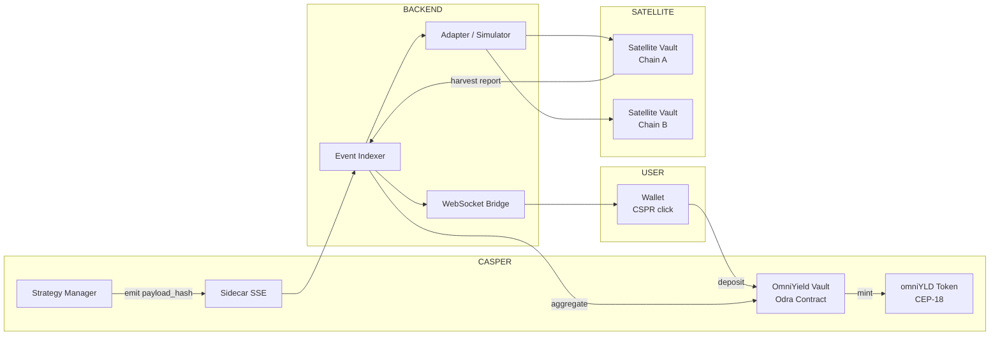
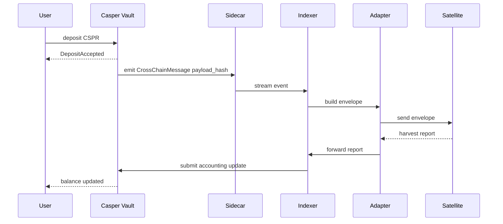
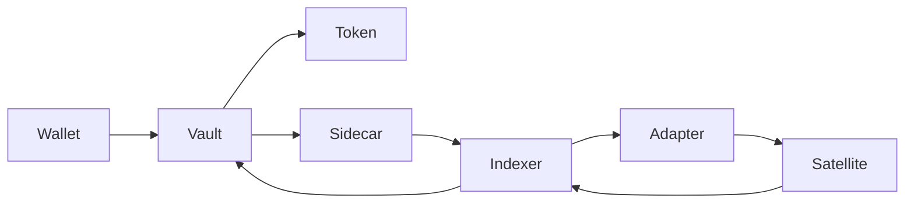
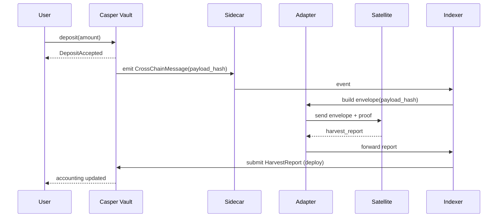

# Casper OmniYield — OmniYield Nexus (Casper Cross-Chain Yield Optimizer)

**Repository:** `https://github.com/lucylow/casper-omniyield/tree/main`

**Status:** Hackathon MVP → Testnet Prototype (Casper Testnet)

**Stack:** Odra (Rust WASM contracts), Casper (Sidecar SSE), CSPR.click wallet, casper-js-sdk, Node.js backend (Sidecar consumer + adapter simulator), Next.js App Router frontend (React + TypeScript), Docker, Jest, Cargo Odra tests.

 OmniYield Nexus is a Casper-native coordination hub for cross-chain yield optimization. Users deposit CSPR into a Casper vault and receive a synthetic CEP-18 token `omniYLD`. The protocol emits deterministic `payload_hash` events that off-chain adapters/relayers can consume and forward to satellite vaults on other chains (MVP uses simulated satellite execution). On-chain accounting and event streams are anchored on Casper (Sidecar SSE) so the ecosystem has an auditable source of truth.


---

## Table of contents

1. [Architecture (high level)](#architecture-high-level)
2. [Diagrams (Mermaid)](#diagrams-mermaid)
3. [Contracts (Odra) — design & API](#contracts-odra--design--api)
4. [Cross-chain messaging model & envelope spec](#cross-chain-messaging-model--envelope-spec)
5. [Backend — Sidecar SSE consumer & adapter simulator](#backend--sidecar-sse-consumer--adapter-simulator)
6. [Frontend — Next.js dApp (App Router) & pages](#frontend--nextjs-dapp-app-router--pages)
7. [Transaction lifecycle, SSE → Activity page, Fork mode](#transaction-lifecycle-sse--activity-page-fork-mode)
8. [Testing & CI](#testing--ci)
9. [Security, error handling & audit notes](#security-error-handling--audit-notes)
10. [Governance & role proofs (named keys)](#governance--role-proofs-named-keys)
11. [API reference & OpenAPI fragment](#api-reference--openapi-fragment)
12. [Mock data & demo scripts](#mock-data--demo-scripts)
13. [Development: run locally (quick start)](#development-run-locally-quick-start)
14. [Roadmap & next steps](#roadmap--next-steps)
15. [Contributing, licensing, contacts](#contributing-licensing-contacts)

---

## Architecture (high level)

OmniYield Nexus separates responsibilities across on-chain and off-chain components to retain minimal trust in contracts and maximize extensibility.

* **Casper (On-chain)** — Vault contract, StrategyManager, CEP-18 synthetic token. Responsible for deposits, minting/burning `omniYLD`, emitting deterministic events (only `payload_hash`), on-chain accounting and invariants.
* **Sidecar / SSE** — Real-time event streaming from Casper nodes (Sidecar or CSPR.cloud streaming API). Indexer / Backend consumes these events to build envelopes and drive adapters.
* **Adapter / Relayer (Off-chain)** — Listens to Sidecar events for `CrossChainMessage` (payload_hash). Builds `Envelope { header, body, proof }`, signs it, and interacts with satellite vaults. For the MVP this is simulated.
* **Satellite Vaults (Other chains)** — Minimal contract/process on target chains (or simulated) executing yield strategies (staking, lending, LP). Returns `harvest_report` back to Casper via the adapter.
* **Frontend (Next.js)** — Multi-page dApp: Dashboard, Deposit, Strategies, Activity (live via WebSocket bridge), Governance (role-based), Settings.
* **NodeOps Autogen / CI** — Build pipeline for wasm, deployment scripts, and automated deploys in CI.

**Design goals:**

* *Canonical anchor*: Casper as the source of truth for accounting and message receipts.
* *Bridge-agnostic*: Emit `payload_hash` + minimal on-chain data so adapters (LayerZero/CCIP/other) can plug in.
* *Safety*: Circuit breakers, timelocks, multi-sig, event observability via Sidecar.
* *MVP pragmatic*: Simulated satellite execution for demo; interface ready for real bridges.

---

## Diagrams (Mermaid)

---

## System Overview (GitHub-Compatible Mermaid)



---

##  Cross-Chain Message Lifecycle (Sequence Diagram)

Sequence diagrams are usually safer, but here is a **fully GitHub-safe version**:




## ✅ Architecture Diagram 




---


### System overview

flowchart LR
  subgraph USER
    U["Wallet<br/>CSPR click"]
  end

  subgraph CASPER
    Vault["OmniYield Vault<br/>Odra Contract"]
    Token["omniYLD Token<br/>CEP-18"]
    Strategy["Strategy Manager"]
    Sidecar["Sidecar SSE"]
  end

  subgraph BACKEND
    Indexer["Event Indexer"]
    Adapter["Adapter / Simulator"]
    WS["WebSocket Bridge"]
  end

  subgraph SATELLITE
    S1["Satellite Vault<br/>Chain A"]
    S2["Satellite Vault<br/>Chain B"]
  end

  U -->|deposit| Vault
  Vault -->|mint| Token
  Strategy -->|emit payload_hash| Sidecar
  Sidecar --> Indexer
  Indexer --> Adapter
  Adapter --> S1
  Adapter --> S2
  S1 -->|harvest report| Indexer
  Indexer -->|aggregate| Vault
  Indexer --> WS
  WS --> U


### Message lifecycle (sequence)



---

## Contracts (Odra) — design & API

Contracts are implemented with the Odra framework for Casper. The code is under `src/` (Rust). Key modules:

* `vault.rs` — deposit, withdraw, ledger, total_locked, pause/unpause, emergency withdrawal hooks. Events: `DepositReceived`, `Redeem`, `VaultPaused`.
* `token.rs` — CEP-18 implementation (odramodules Erc20/CEP18 compatible). `mint`, `burn`, `balance_of`.
* `strategy_manager.rs` — issues `CrossChainMessage` events containing the `payload_hash` computed with blake2b over canonical serialized bytes.
* `access_control.rs` — named keys for governors/operators and read entrypoints to query roles (trustless role proofs).
* `errors.rs` — typed error enum with deterministic codes (see Error Handling).

### Example: event declarations (Rust / Odra)

```rust
#[odra::event]
pub struct CrossChainMessage {
    pub source_chain: String,
    pub destination_chain: String,
    pub payload_hash: String,
    pub nonce: u64,
}
```

### Example: deposit (simplified)

```rust
#[odra::module]
impl Vault {
    #[odra(payable)]
    pub fn deposit(&mut self) -> Result<(), OdraError> {
        let caller = self.env().caller();
        let amount = self.env().attached_value();
        ensure!(amount > U512::zero(), OmniYieldError::ZeroDeposit);
        self.ledger.add_balance(caller, amount)?;
        DepositReceived { sender: caller, amount }.emit();
        Ok(())
    }
}
```

**Storage & gas considerations**

* Keep event payloads minimal (emit `payload_hash`, not full payload) to reduce deploy size and gas.
* Use `Var`, `Mapping` types where appropriate; pre-allocate storage keys deterministically for easier off-chain indexing.

---

## Cross-chain messaging model & envelope spec

**Core idea:** contract emits `CrossChainMessage { payload_hash }` which acts as a canonical, small, verifiable receipt on Casper. Off-chain adapters read Sidecar SSE, reconstruct the original payload (or fetch from indexer), construct an envelope, sign it and forward to target chain.

### Envelope structure

```
Envelope {
  Header {
    source_chain: "casper",
    source_contract: "<contract_hash>",
    timestamp: <unix_ms>
  }
  Body {
    action: "allocate",
    asset: "CSPR",
    amount: <motes>,
    recipient: "<target_address>",
    nonce: <u64>
  }
  Proof {
    payload_hash: "0x...",
    adapter_signature: "<sig>",
    merkle_root?: "<optional>"
  }
}
```

### Payload hash (deterministic)

```
payload_bytes = concat(u512_to_bytes(amount), address_bytes(user), u64_to_bytes(timestamp), action_bytes)
payload_hash = blake2b(payload_bytes)
```

**Replay protection:** maintain used nonces map on Casper and check at `process_relay_message`.

**Adapter attestation:** adapter signs the `payload_hash` and attaches `adapter_signature` in the envelope proof.

---

## Backend — Sidecar SSE consumer & adapter simulator

The backend performs three functions:

1. **Sidecar consumer (EventSource/SSE)** — receives events from `https://node.testnet.cspr.cloud/events` or local Sidecar instance; filters by contract hash and event name.
2. **Event Indexer & Storage** — persist events, maintain event history for pagination & UI, and store original payload bytes for reconstructing envelopes (optional).
3. **Adapter / Simulator** — builds envelopes from events, optionally signs them, and forwards to satellite vaults (MVP: simulated satellite contracts on testnets or local processes).

### Essential files

* `backend/src/sidecarListener.ts` — SSE consumer
* `backend/src/indexer.ts` — event persistence + simple SQLite or JSON store
* `backend/src/adapterSimulator.ts` — simple simulation of cross-chain execution and returning `harvest_report`

### Example: TypeScript SSE listener (Node)

```ts
import EventSource from "eventsource";

const sidecarUrl = process.env.CSPR_EVENTS_URL || "https://node.testnet.cspr.cloud/events";
const CONTRACT_HASH = process.env.OMNIYIELD_CONTRACT_HASH!;

const es = new EventSource(sidecarUrl);
es.onmessage = (e) => {
  try {
    const parsed = JSON.parse(e.data);
    if (JSON.stringify(parsed).includes(CONTRACT_HASH)) {
      // extract event details & persist
      handleEvent(parsed);
    }
  } catch (err) {
    console.error("Error parsing SSE event", err);
  }
};
```

### Adapter simulator

* Accepts envelopes and simulates `stake`, `lend`, `lp` behaviour.
* Returns `harvest_report` objects to the indexer which then triggers on-chain reporting or UI updates.

---

## Frontend — Next.js dApp (App Router) & pages

The frontend is a multi-page dApp implemented with **Next.js App Router** (React + TypeScript). Pages include:

* `/dashboard` — overview, TVL, aggregated APY
* `/deposit` — deposit flow (CSPR.click integration)
* `/strategies` — view strategy allocations, trigger simulated rebalances (operators)
* `/activity` — live activity feed from backend WebSocket (Sidecar → backend → WS → UI), with pagination & receipt deep links
* `/governance` — role-based UI; governors/operators can propose & vote
* `/settings` — network & wallet settings

### Important providers & hooks

* `providers/WalletProvider.tsx` — CSPR.click integration & wallet session
* `providers/ProtocolProvider.tsx` — shared protocol data (TVL, APY)
* `providers/ChainProvider.tsx` — chain awareness
* `providers/TxProvider.tsx` — transaction lifecycle state (signing → submitted → finalized/error)
* `hooks/useSidecarEvents.ts` — client SSE or WebSocket hook for live updates (WS is recommended in production for scaling across clients)

### Transaction lifecycle modals

The UI includes a global `TxModal` that reflects transaction states:

* `signing` — waiting for wallet signature
* `submitted` — deploy broadcasted
* `finalized` — Success; provide deploy hash and deep link to `cspr.live` or testnet explorer
* `error` — error with trace / code

---

## Transaction lifecycle, SSE → Activity page, Fork mode

### SSE → Activity & pagination

* Backend broadcasts to WebSocket channels: `project:<projectId>` with structured messages `{ action, data, timestamp }`. UI subscribes and prepends events to the Activity feed.
* Activity feed supports server-side pagination from the indexer (API: `/api/activity?page=X&limit=Y`).

### Testnet fork simulation mode

* A runtime mode switch: `mainnet` | `testnet` | `fork`. In `fork` mode, the adapter simulates satellite execution locally without sending real transactions. This preserves reproducibility for demos and judges.
* UI visually marks simulated transactions and receipts (`SIMULATED_RECEIPT_...`) to avoid confusion.

---

## Testing & CI

### Odra unit tests (OdraVM)

* Run smart contract unit tests quickly locally with the OdraVM backend:

```bash
cargo odra test
```

### Livenet integration tests

* For integration with testnet (requires `.env` with key paths and node addresses):

```bash
ODRA_CASPER_LIVENET_ENV=casper-test cargo run --bin omniyield_livenet --features livenet
```

### Backend tests (Jest)

* Unit tests for SSE parsing, envelope building, and adapter flows:

```bash
cd backend
npm ci
npm test
```

### Frontend tests

* React component unit tests (Jest + React Testing Library) and E2E (Playwright in CI optional).

### CI Overview (example)

* `ci/build-wasm` — cargo odra build → artifact wasm
* `ci/test` — run `cargo odra test`, `npm test` (backend), `pnpm test` (frontend)
* `ci/deploy` — NodeOps Autogen integration (optional) to auto-deploy to testnet when `main` branch updated and tests pass

---

## Security, error handling & audit notes

### Error model (on-chain)

* Typed error enum with deterministic codes (`OmniYieldError`) used consistently across contracts. Example namespaces:

  * `0x0100` Vault errors (ZeroDeposit, InsufficientBalance)
  * `0x0200` Token errors (MintFailed)
  * `0x0300` Cross-chain errors (InvalidPayloadHash, RelayNotAuthorized)
* Use Odra `ensure!` macros and return OdraError with codes.

### Off-chain error handling

* Error events `ErrorOccurred { code, message, context }` emitted to Sidecar SSE for transparency.
* Backend maps on-chain error codes to human-friendly UI messages. Avoid leaking internal stack traces in UI.

### Safety patterns

* **Circuit breaker**: ability to pause adapter processing and block relays.
* **Time-locks**: delay sensitive upgrades and large withdrawals.
* **Multi-sig admin**: governance operations gated by multi-signature keys.
* **Event auditing**: every cross-chain message has on-chain `payload_hash` that is verifiable.

### Audit checklist

* Verify `payload_hash` generation & canonical serialization
* Confirm `used_nonces` and replay protection
* Check mint/burn supply invariants
* Validate role named keys and role_of read entrypoint correctness
* Ensure Sidecar events map addresses properly (avoid false positives)

---

## Governance & role proofs (named keys)

* Access control uses **named keys** and explicit mappings on chain (governors/operators).
* On-chain entrypoint `role_of(address)` returns role code (0/1/2). Frontend calls this read method to **cryptographically verify** roles — no heuristics.
* Governance flow:

  * Create proposal (Governors)
  * Vote (Governors / staked token holders in later phases)
  * Execute (after timelock / voting thresholds)
* Governance proposals are stored as on-chain records; metadata can be stored on IPFS and referenced by hash.

---

## API reference & OpenAPI fragment

A minimal example for the backend's inspector API (Swagger/OpenAPI):

```yaml
openapi: 3.0.3
info:
  title: OmniYield Backend API
  version: 0.1.0
paths:
  /api/projects:
    get:
      summary: List projects
      responses:
        '200':
          description: OK
  /api/activity:
    get:
      parameters:
        - name: page
          in: query
          schema: { type: integer, default: 0 }
        - name: limit
          in: query
          schema: { type: integer, default: 10 }
      responses:
        '200':
          description: Paginated events
```

You can use `swagger-jsdoc` to generate interactive docs from the codebase.

---

## Mock data & demo scripts

* `/mock` — JSON fixtures used by backend & UI for offline demos:

  * `projects.json`, `ws_project_messages.json`, `crosschain_messages.json`
* Demo scripts:

  * `backend/scripts/simulate_deposit_and_relay.js` — simulate a deposit and full message lifecycle for presentation
  * `frontend/scripts/generate-demo-data.ts` — quickly seed UI with sample events

**Quick demo command (local):**

```bash
# start indexer + adapter simulator (backend)
cd backend
npm ci
npm run dev

# start front end (Next.js)
cd frontend
pnpm install
pnpm dev
```

Open `http://localhost:3000` (or `http://localhost:3001` as configured).

---

## Development: run locally (quick start)

1. **Prereqs:** Rust, `wasm32-unknown-unknown` target, Node.js v20+, pnpm/npm, Docker (optional).
2. **Clone:**

```bash
git clone https://github.com/lucylow/casper-omniyield.git
cd casper-omniyield
```

3. **Build contracts:**

```bash
cargo odra build --release
# outputs wasm in target/wasm32-unknown-unknown/release/
```

4. **Start backend (SSE listener + adapter simulator):**

```bash
cd backend
cp .env.example .env
npm ci
npm run dev
```

5. **Start frontend (Next.js):**

```bash
cd frontend
pnpm install
pnpm dev
```

6. **Run tests:**

```bash
# Odra unit tests
cargo odra test

# Backend tests
cd backend && npm test

# Frontend tests (Jest)
cd frontend && pnpm test
```

**.env.example sample**

```bash
# Casper node & sidecar
CSPR_EVENTS_URL=https://node.testnet.cspr.cloud/events
CSPR_NODE_RPC=https://node.testnet.cspr.cloud

# Contract hashes (after deploy)
OMNIYIELD_CONTRACT_HASH=hash-...

# Adapter keys (for signing envelopes)
ADAPTER_PRIVATE_KEY_PATH=./keys/adapter_key.pem

# Backend
WS_PORT=4050
```

---

## Roadmap & next steps

* **Bridge integrations:** LayerZero / Axelar / CCIP adapters (production).
* **Security audits:** third-party audit (Halborn / Trail of Bits).
* **Governance token / DAO:** omniYLD governance layer & treasury.
* **Insurance & slashing:** protect against relay misbehaviour.
* **Formal verification:** invariants & supply conservation proofs.
* **Performance optimization:** batching, gas tuning, storage pruning.

---

## Contributing, licensing, contacts

* **Contributing:** PRs welcome. See `CONTRIBUTING.md` for code standards, commit message style, and branch policy.
* **Code of Conduct:** Please be respectful and follow the repo's code of conduct.
* **License:** MIT (see `LICENSE`).
* **Contact / Maintainers:** lucylow (GitHub) — use Issues for bug reports & feature requests.

---

## Appendix

### Useful commands recap

```bash
# build wasm
cargo odra build --release

# odra tests
cargo odra test

# run backend locally
cd backend
npm ci
npm run dev

# run frontend
cd frontend
pnpm install
pnpm dev
```

### Key files & directories

```
/src (Odra contracts)
  vault.rs
  strategy_manager.rs
  token.rs
  access_control.rs
/backend
  src/sidecarListener.ts
  src/indexer.ts
  src/adapterSimulator.ts
  scripts/
/frontend
  app/ (Next.js App Router pages)
  components/
  providers/
/mock
/docs
```
